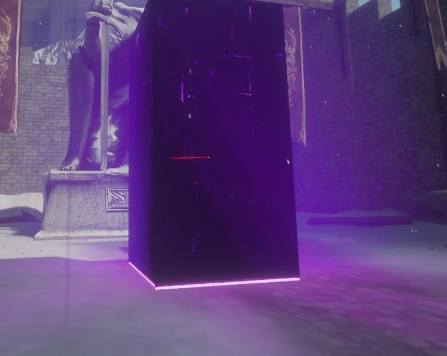
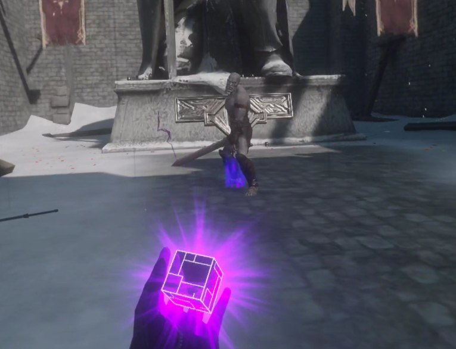
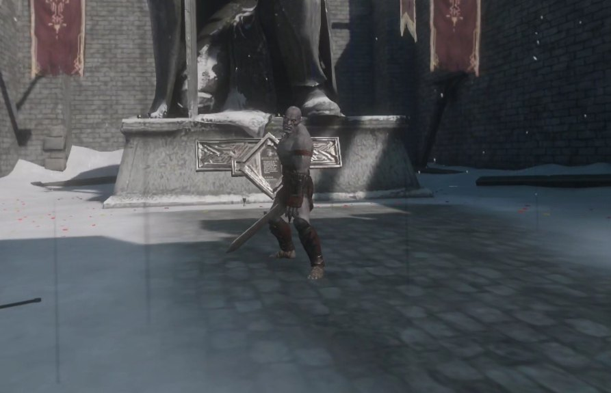
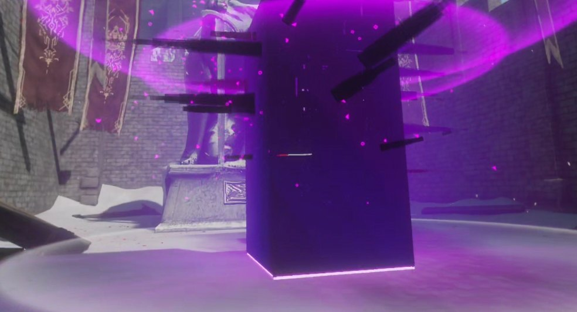
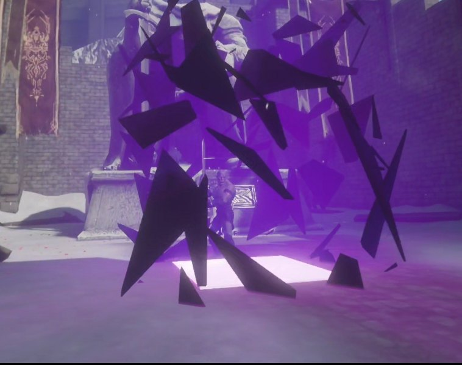

# Hadō #90: Kurohitsugi — Battle Talent VR Mod

A fan-made **Battle Talent VR** spell mod inspired by the visual concept of *Hadō #90: Kurohitsugi*, rebuilt as a standalone magic gem for **Meta Quest 3**.

The mod adds a cinematic dark magic spell with charge targeting, palm preview, ground indicator, reiatsu pressure effects, black coffin formation, rain slash impact, glow phase and final shattering sequence.

> This project was developed as a technical portfolio project focused on Unity modding, Lua scripting, VR interaction design, Git workflow, Addressables, mod.io packaging, and AI-assisted development.

---


## Compatibility

- **Meta Quest 3 standalone:** tested and supported.
- **PCVR / StandaloneWindows:** build included, but not fully validated yet.
- **SteamVR:** currently under investigation after a user report that the spell does not cast.

The mod is currently Quest 3 standalone-first.

---

## Gameplay Preview

[](https://youtu.be/nvYWBhU7-x8)

Watch the gameplay demo on YouTube:

[Hadō #90: Kurohitsugi — Battle Talent VR Mod Gameplay](https://youtu.be/nvYWBhU7-x8)

## Screenshots

| Charge Preview | Grip Reiatsu |
|---|---|
|  |  |

| Coffin Formation | Spike Impact | Final Shattering |
|---|---|---|
|  |  |  |

---

## Download

The mod is available on mod.io for Battle Talent:

[Hado #90: Kurohitsugi on mod.io](https://mod.io/g/battletalent/m/hado-90-kurohitsugi1)

---

## Project Documentation

Additional technical documentation:

- [Technical Breakdown](docs/TECHNICAL_BREAKDOWN.md)
- [AI-Assisted Development Workflow](docs/AI_ASSISTED_WORKFLOW.md)

---


## Features

* Standalone spell gem for Battle Talent
* Trigger hold to charge the spell
* Palm preview cube while charging
* Ground target indicator
* Grip cancel during charge
* Grip-based reiatsu pressure effect
* Black coffin-style formation sequence
* Animated walls, top closure and visual buildup
* Reiatsu ring and center effects
* Rain slash / piercing phase
* Final glow and shattering effect
* Tested on Meta Quest 3 standalone
* Published publicly through mod.io

---

## Gameplay Flow

1. Spawn and equip the Kurohitsugi spell gem.
2. Hold the trigger to begin charging.
3. A preview cube appears near the hand.
4. A target indicator appears on the ground.
5. Aim the spell area.
6. Release the trigger to cast.
7. The Kurohitsugi sequence forms around the target.
8. Reiatsu effects, slash impacts and the final shattering phase are triggered.

Grip can be used to cancel the spell while charging. Grip can also activate a separate reiatsu pressure effect when used outside the cast release flow.

---

## Technical Stack

* **Engine:** Unity 2020.3.48f1
* **Game:** Battle Talent VR
* **Target platform:** Meta Quest 3 standalone
* **Toolkit:** Battle Talent Mod Toolkit
* **Scripting:** Lua
* **Asset pipeline:** Unity Prefabs, Materials, Shaders, Addressables
* **Distribution:** mod.io
* **Version control:** Git / GitHub

---

## Technical Highlights

### Spell Gem Interaction

The spell is implemented as a standalone Battle Talent gem. The interaction flow is based on a charge-and-release pattern:

* trigger press starts the charging phase;
* visual feedback is shown on the hand and on the ground;
* release triggers the full Kurohitsugi cast sequence;
* grip can cancel or activate an additional reiatsu pressure effect.

### Kurohitsugi Sequence System

The main sequence combines multiple staged visual elements:

* palm preview;
* target indicator;
* line buildup;
* wall formation;
* top closure;
* reiatsu center and ring effects;
* rain slash phase;
* glow impact;
* final shattering.

The timing was tuned for a cinematic effect while keeping the spell usable in VR gameplay.

### Addressables and Packaging

The project required a clean Addressables setup to make the mod load correctly in Battle Talent.

The final mod.io package uses the correct Battle Talent mod structure:

```text
EXP_Hado90_Kurohitsugi/
├── Android/
├── Android.meta
├── StandaloneWindows/
└── StandaloneWindows.meta
```

Generated build output is intentionally excluded from the repository through `.gitignore`.

### Meta Quest 3 Standalone Constraints

The mod was tested directly on Meta Quest 3 standalone. This required attention to:

* performance-friendly visual effects;
* asset bundle size;
* shader compatibility;
* prefab cleanup;
* runtime Lua errors;
* mod.io packaging behavior;
* in-game installation and loading.

---

## AI-Assisted Development Workflow

This project was developed with an AI-assisted workflow.

AI was used as a technical support tool for:

* debugging Lua and Unity-related issues;
* planning script refactors;
* analyzing Git status, branch and tag workflows;
* improving repository cleanup;
* preparing release notes and documentation;
* reasoning through mod.io packaging problems;
* translating technical problems into testable steps.

The implementation was tested manually in Unity and on Meta Quest 3. AI suggestions were validated through direct in-game testing, Git commits, branch isolation and iterative debugging.

---

## Git Workflow

The project uses a structured Git workflow with feature, cleanup and release branches.

Important branch:

```text
release/modio-clean-build
```

Important public tag:

```text
modio-0.1.6-public
```

The `main` branch contains the public portfolio version of the project.

---

## Current Public Version

```text
Version: 0.1.6
Status: Public on mod.io
Target: Battle Talent standalone / Meta Quest 3
```

---

## Known Limitations

This is a fan-made mod and an ongoing learning project.

Known areas for future improvement:

* further cleanup of runtime console warnings;
* improved damage balancing;
* additional optimization for standalone VR;
* more polished VFX transitions;
* expanded documentation for setup/build steps;
* possible future conversion into a gesture-based magic system.

---

## Disclaimer

This is a fan-made Battle Talent mod inspired by the visual concept of Kurohitsugi / Hadō #90.

This project is not affiliated with Bleach, Shueisha, Studio Pierrot, Tite Kubo, Battle Talent, or any official rights holders.

All original trademarks and intellectual properties belong to their respective owners.

This repository is intended as a technical portfolio project and modding showcase.
